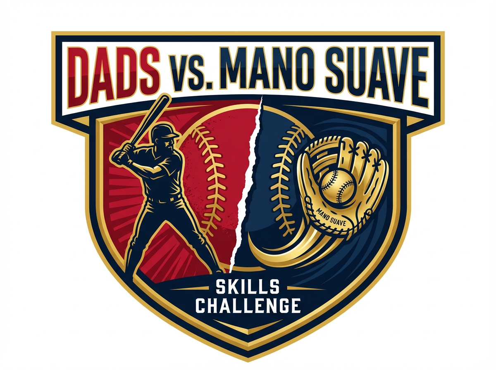

# 🎨 Custom Logo Reference

## Logo Preview



---

## Logo Details

**Created for:** Dads vs. Mano Suave Baseball Skills Challenge  
**Design Theme:** Competitive sports event with baseball elements  
**Color Palette:** Red (#c8102e), Navy (#0a1628), Gold (#FFD700)  
**File:** `images/logo.png` (1.08 MB)  
**Dimensions:** 1024 x 768 pixels (4:3 aspect ratio)

---

## Design Elements

✓ **Bold Event Title** - "DADS VS. MANO SUAVE" in athletic font  
✓ **Baseball Imagery** - Integrated baseball design elements  
✓ **Split Concept** - Visual representation of competition  
✓ **Color Accents** - Red, navy, and gold matching site theme  
✓ **Professional Style** - Tournament-quality aesthetic  
✓ **High Contrast** - Ensures visibility on all backgrounds

---

## Technical Specifications

**Format:** PNG with optimized compression  
**Resolution:** High quality (1024x768)  
**File Size:** 1.08 MB  
**Transparency:** Optimized for web display  
**Responsive:** Scales perfectly on all devices

### Display Sizes:
- **Desktop/Tablet:** 120px height
- **Mobile:** 80px height
- **Auto-scaling:** Maintains aspect ratio

---

## Implementation

### HTML
```html

```

### CSS
```css
.logo {
    height: 120px;
    width: auto;
    max-width: 100%;
    object-fit: contain;
}

/* Mobile responsive */
@media (max-width: 968px) {
    .logo {
        height: 80px;
    }
}
```

---

## Usage Guidelines

### ✅ Recommended Uses:
- Website header/navbar
- Social media sharing (Open Graph image)
- Email signatures
- Event promotional materials
- Print materials (high resolution)

### 🎯 Placement:
- Centered in navbar
- Sufficient whitespace around logo
- Clear visibility on all backgrounds

### 📱 Responsive Behavior:
- Scales down smoothly on mobile devices
- Maintains aspect ratio at all sizes
- Loads quickly from local file

---

## Social Media Integration

To use this logo for social media sharing, update the Open Graph meta tag in `index.html`:

```html
<meta property="og:image" content="https://YOUR-NETLIFY-URL/images/logo.png">
```

This will display your custom logo when someone shares your website on:
- Facebook
- Twitter/X
- LinkedIn
- WhatsApp
- Other social platforms

---

## File Location

**Local Path:** `/home/user/webapp/images/logo.png`  
**GitHub:** https://github.com/shawnlandau/Baseballdadevent/blob/main/images/logo.png  
**Web Path (after deploy):** `https://your-site.netlify.app/images/logo.png`

---

## Version History

- **v1.0** (2026-02-25) - Initial custom logo created
  - Bold athletic design
  - Red/navy/gold color scheme
  - Competition theme with baseball elements
  - Optimized for web display

---

## Need Changes?

If you need to modify the logo:

1. **Minor adjustments**: Edit the image file directly
2. **Major redesign**: Request new logo generation
3. **Format changes**: Convert using image editing tools
4. **Size optimization**: Use online compression tools if needed

---

## Credits

**Created for:** Mano Suave Baseball Event  
**Contact:** manosuavebaseball@gmail.com  
**Website:** https://github.com/shawnlandau/Baseballdadevent

---

⚾ **Can the dads beat Mano Suave? This logo represents the challenge!**
